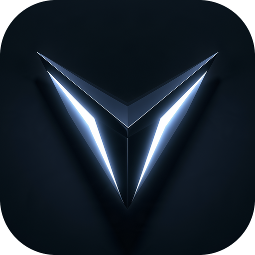

# Brand and links

## Official channels

| Channel  | Address                                                  |
| -------- | -------------------------------------------------------- |
| Website  | [iridius.xyz](https://iridius.xyz)                 |
| X        | [@iridiusxyz](https://x.com/iridiusxyz)                  |
| Contact  | hello@iridius.xyz                                     |

A domain or handle claiming to be Iridius that is not listed above does not belong to us. Contract addresses are published only on this documentation site and on the website.

## Name

The name is written **Iridius**, with just the first letter capitalised, and is never put in all caps within running text.

## Voice

The product and the documentation share a single voice: calm, technical and precise. Sentences are short and declarative, numbers always carry their units, costs are broken out line by line instead of summarised, and risks are stated where readers will actually see them, not hidden in footnotes. There is no hype, no exclamation mark and no invented urgency. If a sceptical auditor could quote a sentence back at us to our discomfort, it gets rewritten until they could not.

## Visual identity

The look is mission control with an engineer's precision: near-black space, steel surfaces and a single source of light. The words stay modern and technical, so no myth, legend or metaphor appears in a feature name, a button label, an error string or a contract identifier.

The interface is built as a dark instrument. The page is a deep navy void, sections step between the void and a slightly lighter base, and cards sit on steel surfaces separated by precise hairlines rather than shadows. The only light in the system comes from the mark: the ice blue that glows along its lit edges is the one accent, used for links, focus and the few things that should draw the eye. Real product UI, such as the swap ticket and live quotes, is shown as the hero object instead of illustration.

The mark is a faceted chevron in dark metal, with its two inner edges lit a bright white, set on a deep navy tile with rounded corners. The tile travels with the mark, so it reads the same on every surface. App icons use the same tile, cropped square, and nothing more. The shape holds up even at favicon size.

Layouts favour big, confident headlines, generous negative space and a calm rhythm of sections. A short monospace overline names each section, the headline follows, and the content sits below. Behind the hero, a quiet starfield and a soft ice glow set the scene; nothing else is decorative. Depth comes from borders, surface steps and light, never from heavy shadows or gradients.

<figure><figcaption></figcaption></figure>

### Palette

| Token        | Hex       | Use                                              |
| ------------ | --------- | ------------------------------------------------ |
| Void         | `#05090f` | The page background                               |
| Base         | `#08101a` | Alternate sections                                |
| Surface      | `#0c1521` | Cards and popovers                                |
| Raised       | `#121e2d` | Raised controls, shaded rows and loading skeletons |
| Steel        | `#253750` | Strong edges and inactive tracks                  |
| Foreground   | `#f3f7fb` | Headings, primary text and the primary button     |
| Foreground 2 | `#b4c0cf` | Body and secondary text                           |
| Foreground 3 | `#8592a3` | Labels, overlines and supporting text             |
| Foreground 4 | `#76828f` | The faintest text, such as timestamps and sub-labels |
| Ice          | `#8eb6e8` | The single accent: links, focus rings, highlights and the lit dot |
| Ice bright   | `#d3e6fc` | The brightest highlights and lit text             |
| Ice deep     | `#4f6d97` | Quiet accent edges and fills                      |
| Up           | `#5fd0a5` | Gains, live and positive states                   |
| Down         | `#f2836f` | Losses and errors                                 |
| Warn         | `#e9bd72` | Warnings, the extended session and closed markets |
| Line         | `rgb(150 182 226 / 0.1)` | Hairline borders and dividers      |
| Line strong  | `rgb(150 182 226 / 0.18)` | Emphasised borders and input edges |

Every text step clears WCAG AA against the void, and primary and body text clear AAA.

### Type

* Display: Space Grotesk at weight 500 with tight tracking. Used for headlines, the wordmark and section titles, in sentence case.
* Body: Geist, at 15 to 17px in the secondary foreground.
* Overlines, labels and figures: Geist Mono, tabular. All caps is reserved for short overlines of a few words.

### Shape

Radius grows with the element and is never one value everywhere: 6px for tags, 10 to 12px for small controls and inputs, a full pill for buttons, 20px for cards, 24px for the single hero surface on a screen, and 28 to 32px for large panels.

### Usage

* Always show the mark on its navy tile. Do not cut it out, recolour it or place it on a saturated colour.
* Never add an outline, a drop shadow or an extra glow to the tile; the lit edges carry all the light it needs.
* Leave clear space around the tile equal to at least half its width.
* The interface is dark only. No light surfaces, and no pure black or pure white backgrounds.
* Use one accent, ice, and nothing else. No neon, no rainbow gradients and no purple.
* The primary button, lit white, is the brightest thing on a screen. Shadows appear only on that button and on the single hero surface.
* Use up, down and warn only for state, meaning values and status, and for nothing else.
